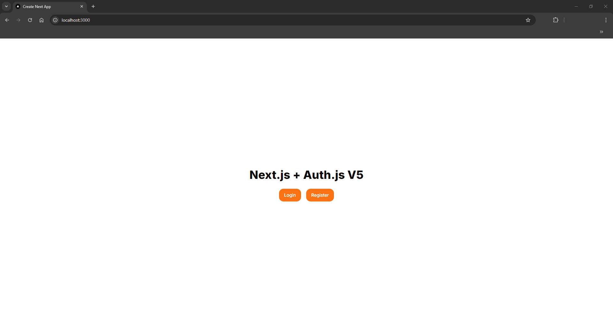
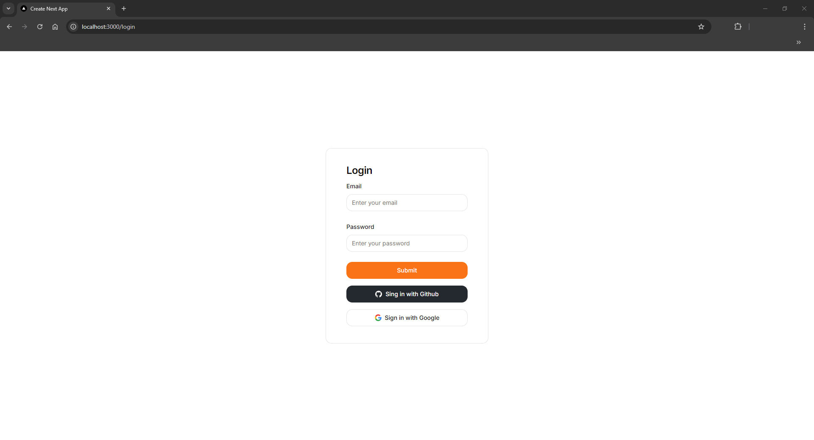
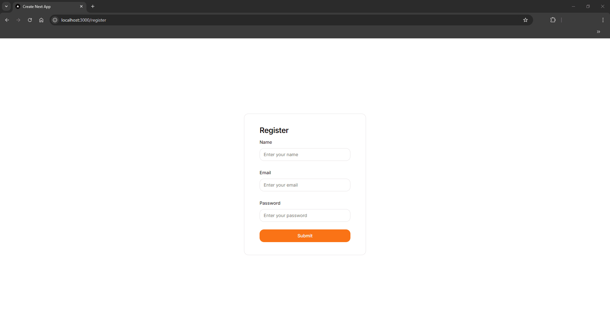
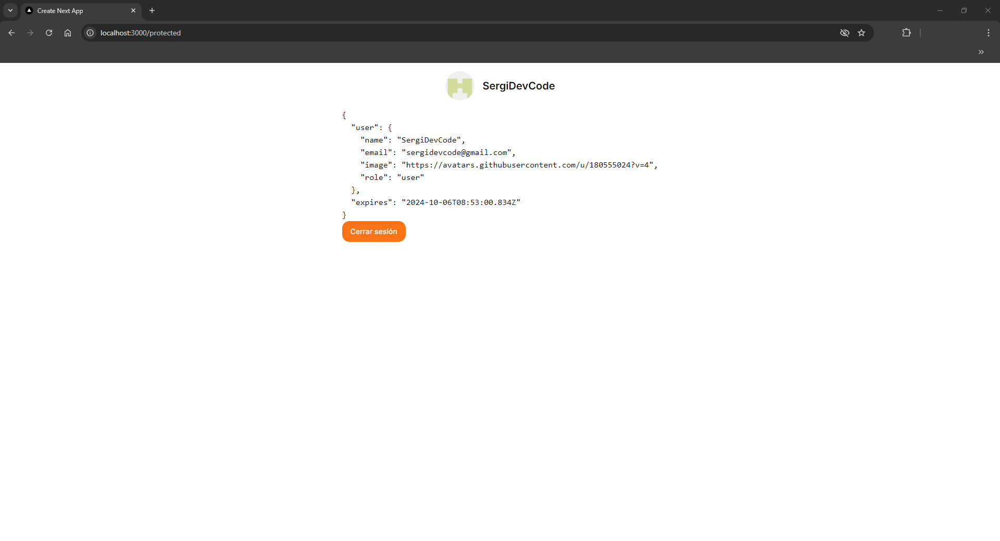

# **Next.js + Auth.js V5 + Prima ORM/PostgreSQL + Resend (Emails) + Shadcn/ui**

## **Auth.js v5 beta** usando Credentials + OAuth

## Inicio

</img>

## Login

</img>

## Register

</img>

## User

</img>

## Dependencias Principales
- **@auth/prisma-adapter:** Adaptador de Prisma para next-auth.
- **@hookform/resolvers:** Resolutores para react-hook-form.
- **@prisma/client:** Cliente de Prisma.
- **@radix-ui/react-label:** Componente de etiqueta de Radix UI.
- **@radix-ui/react-slot:** Componente de slot de Radix UI.
- **bcryptjs:** Biblioteca para hashing de contraseñas.
- **class-variance-authority:** Utilidad para gestionar clases CSS.
- **clsx:** Utilidad para concatenar clases CSS.
- **lucide-react:** Iconos para React.
- **nanoid:** Generador de IDs únicos.
- **next:** Framework de React.
- **next-auth:** Biblioteca de autenticación para Next.js.
- **react:** Biblioteca de JavaScript para construir interfaces de usuario.
- **react-dom:** Paquete de React para el DOM.
- **react-hook-form:** Biblioteca para la gestión de formularios.
- **resend:** Biblioteca para reenvío de correos electrónicos.
- **tailwind-merge:** Utilidad para combinar clases de Tailwind CSS.
- **tailwindcss-animate:** Animaciones para Tailwind CSS.
- **zod:** Biblioteca de validación de esquemas.

## Dependencias de Desarrollo
- **@types/bcryptjs:** Tipos para bcryptjs.
- **@types/node:** Tipos para Node.js.
- **@types/react:** Tipos para React.
- **@types/react-dom:** Tipos para React DOM.
- **eslint:** Herramienta de análisis de código.
- **eslint-config-next:** Configuración de ESLint para Next.js.
- **postcss:** Herramienta para transformar CSS.
- **prisma:** ORM para Node.js y TypeScript.
- **tailwindcss:** Framework de CSS.
- **typescript:** Lenguaje de programación tipado.


``` node
npm i
```

``` node
npx prisma db push
```

``` node
npm run dev
```